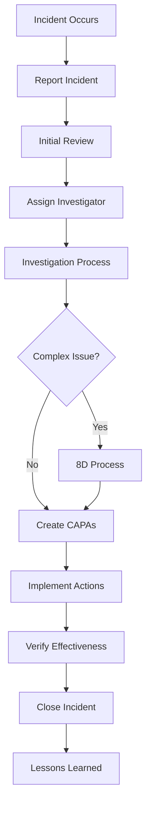

# 🚀 COMPLETE INCIDENT MANAGEMENT WORKFLOW GUIDE
## Step-by-Step Process from Incident to Closure

**Version:** 1.0  
**Date:** 2025-01-25  
**Status:** Production Ready

---

## 🎯 OVERVIEW

This guide provides a complete step-by-step workflow for the incident management system, covering all processes from initial incident reporting to final closure.

---

## 📋 WORKFLOW STAGES

---

## 📝 STEP 1: INCIDENT REPORTING

### **🎯 Objective:** Report and document the incident

### **👤 Who:** Any employee who witnesses or is involved in an incident

### **📱 Frontend Process:**
1. **Navigate:** `Dashboard > Incident Management > Incidents`
2. **Click:** "Create Incident" button
3. **Fill Form:**
   - **Title:** Brief description (e.g., "Crane #5 Hydraulic Failure")
   - **Description:** Detailed account (10-1000 characters)
   - **Type:** Select from 16 types (injury, equipment_failure, etc.)
   - **Severity:** Critical/High/Medium/Low
   - **Location:** Where it occurred
   - **Department:** Affected department
   - **Date/Time:** When it happened
   - **Reporter Name:** Person reporting
   - **Immediate Actions:** What was done immediately
   - **Attachments:** Photos, documents, evidence

### **🔧 Backend Process:**
1. **API Call:** `POST /api/v1/incidentmanagement/incidents/`
2. **Auto-Generate:** Unique incident ID (e.g., INC-2024-001)
3. **Database:** Store in `incidentmanagement_incident` table
4. **Audit Log:** Create entry in `incidentmanagement_incidentauditlog`
5. **Notifications:** Send to relevant stakeholders
6. **Status:** Set to "reported"

### **📊 Expected Outcome:**
- ✅ Incident recorded with unique ID
- ✅ Stakeholders notified
- ✅ Audit trail started
- ✅ Status: "Reported"

---

## 🔍 STEP 2: INITIAL REVIEW & ASSIGNMENT

### **🎯 Objective:** Review incident and assign investigator

### **👤 Who:** Safety Manager or Department Head

### **📱 Frontend Process:**
1. **Navigate:** `Dashboard > Incident Management > Incidents`
2. **View:** Incident list with new reports
3. **Click:** "View Details" on incident
4. **Review:** Incident details and severity
5. **Assign:** Click "Assign Investigator"
6. **Select:** Qualified investigator from dropdown
7. **Update Status:** Change to "Under Investigation"

### **🔧 Backend Process:**
1. **API Call:** `POST /incidents/{id}/assign_investigator/`
2. **Update:** `assigned_investigator` field
3. **Status Change:** Update to "under_investigation"
4. **Notification:** Send to assigned investigator
5. **Audit Log:** Record assignment action

### **📊 Expected Outcome:**
- ✅ Investigator assigned
- ✅ Status: "Under Investigation"
- ✅ Investigator notified
- ✅ Timeline started

---

## 🔬 STEP 3: INVESTIGATION PROCESS

### **🎯 Objective:** Conduct thorough investigation and root cause analysis

### **👤 Who:** Assigned Investigator + Investigation Team

### **📱 Frontend Process:**
1. **Navigate:** `Dashboard > Incident Management > Investigations`
2. **Click:** "New Investigation" or find existing
3. **Fill Investigation Form:**
   - **Investigator:** Auto-assigned
   - **Start Date:** Investigation start
   - **Target Completion:** Expected completion date
   - **Method:** Root Cause Analysis, 5 Why, Fishbone, etc.
   - **Team Members:** Add investigation team
   - **Witnesses:** Interview and document
   - **Evidence:** Upload files and photos
   - **Root Cause Analysis:** Detailed findings
   - **Summary:** Investigation summary
   - **Recommendations:** Action recommendations

### **🔧 Backend Process:**
1. **API Call:** `POST /api/v1/incidentmanagement/investigations/`
2. **Database Storage:**
   - Main record: `incidentmanagement_investigation`
   - Team: `incidentmanagement_investigationteammember`
   - Witnesses: `incidentmanagement_witness`
   - Evidence: `incidentmanagement_investigationevidence`
   - Recommendations: `incidentmanagement_investigationrecommendation`
3. **Progress Tracking:** Update percentage completion
4. **Status Updates:** Track investigation progress

### **📊 Expected Outcome:**
- ✅ Complete investigation record
- ✅ Root cause identified
- ✅ Evidence documented
- ✅ Recommendations made
- ✅ Status: Investigation completed

---

## 🛠️ STEP 4: 8D PROCESS (For Complex Issues)

### **🎯 Objective:** Systematic problem solving for complex incidents

### **👤 Who:** 8D Team Leader + Cross-functional Team

### **📱 Frontend Process:**
1. **Navigate:** `Dashboard > Incident Management > 8D Process`
2. **Click:** "Start New 8D Process"
3. **Follow 8 Disciplines:**

   **D1: Form Team**
   - Select team leader
   - Add team members with roles
   - Define responsibilities

   **D2: Define Problem**
   - Problem statement
   - Impact assessment
   - Scope definition

   **D3: Implement Containment**
   - Immediate containment actions
   - Verify effectiveness
   - Document results

   **D4: Root Cause Analysis**
   - Identify root causes
   - Use analysis tools
   - Verify causes

   **D5: Choose Corrective Actions**
   - Select permanent solutions
   - Risk assessment
   - Implementation plan

   **D6: Implement Solutions**
   - Execute corrective actions
   - Monitor implementation
   - Verify effectiveness

   **D7: Prevent Recurrence**
   - System improvements
   - Process updates
   - Training programs

   **D8: Congratulate Team**
   - Recognize team efforts
   - Document lessons learned
   - Share knowledge

### **🔧 Backend Process:**
1. **API Calls:** Multiple endpoints for each discipline
2. **Database Storage:**
   - Process: `incidentmanagement_eightdprocess`
   - Disciplines: `incidentmanagement_eightddiscipline`
   - Team: `incidentmanagement_eightdteam`
   - Containment: `incidentmanagement_eightdcontainmentaction`
   - Root Causes: `incidentmanagement_eightdrootcause`
   - Corrective Actions: `incidentmanagement_eightdcorrectiveaction`
   - Prevention: `incidentmanagement_eightdpreventionaction`
3. **Progress Tracking:** Overall and per-discipline progress
4. **Status Management:** Track completion of each discipline

### **📊 Expected Outcome:**
- ✅ Systematic problem solving completed
- ✅ Root causes eliminated
- ✅ Preventive measures implemented
- ✅ Team recognized
- ✅ Knowledge documented

---

## ✅ STEP 5: CAPA MANAGEMENT

### **🎯 Objective:** Track corrective and preventive actions

### **👤 Who:** CAPA Coordinator + Assigned Personnel

### **📱 Frontend Process:**
1. **Navigate:** `Dashboard > Incident Management > CAPAs`
2. **Create CAPAs:** From investigation recommendations
3. **Fill CAPA Form:**
   - **Title:** Action description
   - **Type:** Corrective or Preventive
   - **Description:** Detailed action plan
   - **Assigned Person:** Responsible individual
   - **Due Date:** Completion deadline
   - **Priority:** Critical/High/Medium/Low
   - **Resources:** Required resources
   - **Cost Estimate:** Financial impact

4. **Track Progress:**
   - Regular status updates
   - Progress percentage
   - Milestone tracking
   - Overdue alerts

5. **Verification:**
   - Effectiveness verification
   - Completion sign-off
   - Documentation

### **🔧 Backend Process:**
1. **API Call:** `POST /api/v1/incidentmanagement/capas/`
2. **Database Storage:**
   - Main record: `incidentmanagement_capa`
   - Updates: `incidentmanagement_capaupdate`
3. **Status Tracking:** Pending → In Progress → Completed → Verified
4. **Overdue Detection:** Automatic flagging of overdue CAPAs
5. **Notifications:** Reminders and alerts

### **📊 Expected Outcome:**
- ✅ All actions tracked and managed
- ✅ Deadlines monitored
- ✅ Progress documented
- ✅ Effectiveness verified
- ✅ Status: Completed and Verified

---

## 📊 STEP 6: ANALYTICS & REPORTING

### **🎯 Objective:** Generate insights and reports

### **👤 Who:** Safety Manager, Management Team

### **📱 Frontend Process:**
1. **Dashboard Analytics:**
   - Navigate: `Dashboard > Incident Management > Dashboard`
   - View real-time statistics
   - Monitor trends and KPIs

2. **Detailed Analytics:**
   - Navigate: `Dashboard > Incident Management > Analytics`
   - Incident trends over time
   - Severity distribution
   - Department-wise analysis
   - Risk assessment matrix

3. **Generate Reports:**
   - Navigate: `Dashboard > Incident Management > Reports`
   - Select report type:
     - Incident Summary
     - Incidents by Type
     - Incidents by Status
     - Monthly Trends
     - Department Analysis
   - Set date range
   - Export to PDF/Excel

### **🔧 Backend Process:**
1. **Analytics APIs:** Various endpoints for different metrics
2. **Data Aggregation:** Real-time calculation of statistics
3. **Report Generation:** Dynamic report creation
4. **Export Functions:** PDF and Excel generation

### **📊 Expected Outcome:**
- ✅ Real-time insights available
- ✅ Trends identified
- ✅ Reports generated
- ✅ Data-driven decisions enabled

---

## 🔒 STEP 7: INCIDENT CLOSURE

### **🎯 Objective:** Formally close the incident

### **👤 Who:** Safety Manager or Authorized Personnel

### **📱 Frontend Process:**
1. **Verify Completion:**
   - All CAPAs completed and verified
   - Investigation findings documented
   - Actions implemented and effective

2. **Close Incident:**
   - Navigate to incident details
   - Click "Close Incident"
   - Add closure notes
   - Confirm closure

### **🔧 Backend Process:**
1. **API Call:** `POST /incidents/{id}/close_incident/`
2. **Status Update:** Change to "closed"
3. **Validation:** Ensure all requirements met
4. **Audit Log:** Record closure action
5. **Notifications:** Inform stakeholders

### **📊 Expected Outcome:**
- ✅ Incident formally closed
- ✅ All actions completed
- ✅ Documentation complete
- ✅ Status: "Closed"

---

## 📚 STEP 8: LESSONS LEARNED

### **🎯 Objective:** Capture and share knowledge

### **👤 Who:** Investigation Team, Safety Committee

### **📱 Frontend Process:**
1. **Document Lessons:**
   - Key findings
   - Effective solutions
   - Process improvements
   - Training needs

2. **Share Knowledge:**
   - Team meetings
   - Training sessions
   - Process updates
   - Best practices

### **🔧 Backend Process:**
1. **Storage:** `incidentmanagement_incidentlearning` table
2. **Knowledge Base:** Searchable lessons learned
3. **Analytics:** Learning effectiveness tracking

### **📊 Expected Outcome:**
- ✅ Knowledge captured
- ✅ Lessons shared
- ✅ Processes improved
- ✅ Recurrence prevented

---

## 🎯 SUCCESS METRICS

### **📊 Key Performance Indicators:**
- **Response Time:** Time from report to investigation start
- **Investigation Time:** Time to complete investigation
- **CAPA Completion Rate:** Percentage of CAPAs completed on time
- **Recurrence Rate:** Percentage of similar incidents
- **Cost Impact:** Financial impact reduction
- **Learning Effectiveness:** Knowledge application rate

### **📈 Continuous Improvement:**
- Regular workflow reviews
- Process optimization
- Technology updates
- Training enhancements
- Stakeholder feedback

---

## 🎉 CONCLUSION

This comprehensive workflow ensures:
- ✅ **Systematic incident handling**
- ✅ **Thorough investigations**
- ✅ **Effective corrective actions**
- ✅ **Continuous improvement**
- ✅ **Knowledge management**
- ✅ **Regulatory compliance**

**The system is ready for full production use!** 🚀
