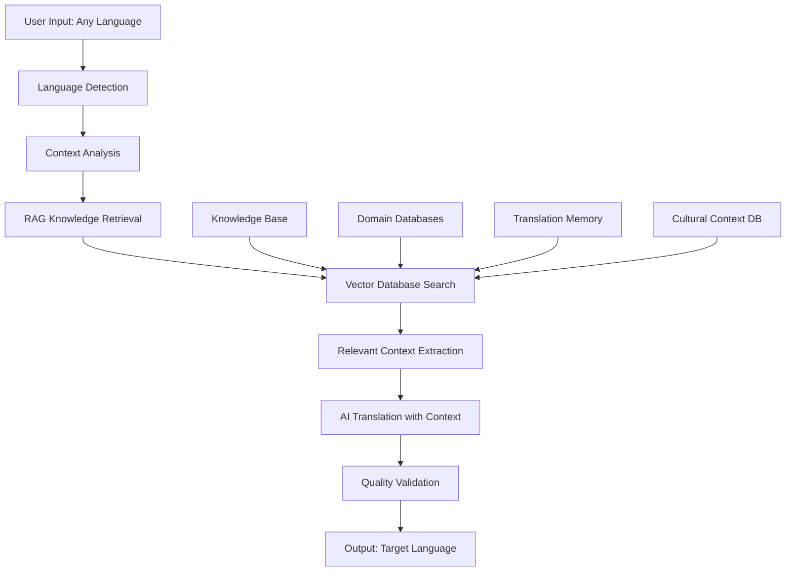

# Universal AI Translation Agent with RAG Architecture

## 🌍 Universal Translation Vision

Transform from Tamil-focused to **any-language-to-any-language** translation agent with RAG (Retrieval-Augmented Generation) for superior accuracy, context awareness, and domain expertise.

## 🧠 RAG-Enhanced Translation Architecture

### Core RAG Components



### RAG Knowledge Sources

#### 1. Multilingual Knowledge Base
```yaml
Content Types:
  - Business terminology (200+ languages)
  - Technical documentation
  - Legal and medical terms
  - Cultural context and idioms
  - Industry-specific glossaries
  - Regional dialects and variations

Storage:
  - Vector Database: Pinecone/Weaviate/Chroma
  - Traditional DB: PostgreSQL with pgvector
  - Document Store: Elasticsearch
  - Cache Layer: Redis with vector support
```

#### 2. Translation Memory System
```yaml
Components:
  - Previous translations database
  - User correction history
  - Domain-specific translation pairs
  - Quality scores and feedback
  - Context-translation mappings

Benefits:
  - Consistency across translations
  - Learning from corrections
  - Faster translation for repeated content
  - Quality improvement over time
```

#### 3. Cultural Context Database
```yaml
Cultural Elements:
  - Formal vs informal language patterns
  - Business etiquette by country/culture
  - Religious and cultural sensitivities
  - Regional communication styles
  - Time and date formats
  - Currency and measurement units
```

## 🏗️ Technical Architecture

### RAG-Enhanced Translation Pipeline

```python
class RAGTranslationService:
    def __init__(self):
        self.vector_db = PineconeClient()
        self.llm = OpenAI(model="gpt-4-turbo")
        self.embedding_model = OpenAIEmbeddings()
        self.translation_memory = TranslationMemory()
        self.cultural_context = CulturalContextDB()
    
    async def translate_with_rag(self, text: str, source_lang: str, target_lang: str, domain: str = None):
        # 1. Detect and analyze input
        context = await self.analyze_context(text, source_lang, domain)
        
        # 2. Retrieve relevant knowledge
        relevant_docs = await self.retrieve_knowledge(text, source_lang, target_lang, domain)
        
        # 3. Check translation memory
        tm_match = await self.translation_memory.find_match(text, source_lang, target_lang)
        
        # 4. Get cultural context
        cultural_info = await self.cultural_context.get_context(source_lang, target_lang)
        
        # 5. Generate translation with context
        translation = await self.generate_translation(
            text, source_lang, target_lang, relevant_docs, cultural_info, tm_match
        )
        
        # 6. Validate and score quality
        quality_score = await self.validate_translation(translation, context)
        
        # 7. Store in translation memory
        await self.translation_memory.store(text, translation, source_lang, target_lang, quality_score)
        
        return TranslationResult(
            original=text,
            translated=translation,
            source_lang=source_lang,
            target_lang=target_lang,
            quality_score=quality_score,
            context_used=relevant_docs,
            cultural_adaptations=cultural_info
        )
```

### Vector Database Schema

```python
# Document embeddings for RAG
class KnowledgeDocument:
    id: str
    content: str
    language: str
    domain: str  # business, legal, medical, technical
    source: str  # wikipedia, business_docs, user_corrections
    embedding: List[float]  # 1536-dim vector
    metadata: Dict[str, Any]
    quality_score: float
    last_updated: datetime

# Translation pairs for memory
class TranslationPair:
    id: str
    source_text: str
    target_text: str
    source_lang: str
    target_lang: str
    domain: str
    context: str
    quality_score: float
    user_feedback: str
    embedding: List[float]
    created_at: datetime
```

## 🌐 Universal Language Support

### Supported Languages (200+)
```yaml
Major Languages:
  - European: English, Spanish, French, German, Italian, Portuguese, Russian, Polish, Dutch
  - Asian: Chinese (Simplified/Traditional), Japanese, Korean, Hindi, Arabic, Thai, Vietnamese
  - Indian: Tamil, Telugu, Malayalam, Kannada, Bengali, Gujarati, Marathi, Punjabi
  - African: Swahili, Yoruba, Zulu, Amharic, Hausa
  - Others: Hebrew, Turkish, Persian, Indonesian, Malay, Filipino

Specialized Support:
  - Business terminology for each language
  - Regional dialects and variations
  - Formal vs informal registers
  - Technical and domain-specific terms
```

### Language Detection & Auto-Routing
```python
class UniversalLanguageDetector:
    def __init__(self):
        self.fasttext_model = fasttext.load_model('lid.176.bin')
        self.polyglot_detector = Detector()
        self.custom_models = {}  # Language-specific fine-tuned models
    
    async def detect_language(self, text: str) -> LanguageDetectionResult:
        # Multi-model approach for accuracy
        fasttext_result = self.fasttext_model.predict(text)
        polyglot_result = self.polyglot_detector.detect(text)
        
        # Confidence scoring and ensemble
        final_language = self.ensemble_prediction([fasttext_result, polyglot_result])
        
        return LanguageDetectionResult(
            language=final_language,
            confidence=confidence_score,
            alternatives=alternative_languages,
            script_type=self.detect_script(text)
        )
```

## 🚀 Enhanced Features with RAG

### 1. Domain-Specific Translation
```yaml
Business Domains:
  - Legal contracts and documents
  - Medical and healthcare
  - Financial and banking
  - Technology and software
  - Manufacturing and engineering
  - Marketing and advertising
  - Academic and research

RAG Benefits:
  - Accurate technical terminology
  - Consistent domain language
  - Context-aware translations
  - Industry best practices
```

### 2. Real-time Learning System
```python
class ContinuousLearningSystem:
    async def learn_from_correction(self, original: str, corrected: str, context: Dict):
        # 1. Store correction in knowledge base
        await self.store_correction(original, corrected, context)
        
        # 2. Update vector embeddings
        embedding = await self.generate_embedding(corrected, context)
        await self.vector_db.upsert(embedding)
        
        # 3. Retrain domain-specific models
        if self.should_retrain(context['domain']):
            await self.trigger_model_update(context['domain'])
        
        # 4. Update translation memory
        await self.translation_memory.update_with_correction(original, corrected)
```

### 3. Cultural Adaptation Engine
```python
class CulturalAdaptationEngine:
    def __init__(self):
        self.cultural_db = CulturalKnowledgeBase()
        self.adaptation_rules = AdaptationRuleEngine()
    
    async def adapt_translation(self, translation: str, source_culture: str, target_culture: str):
        # Cultural context retrieval
        cultural_context = await self.cultural_db.get_context(source_culture, target_culture)
        
        # Apply adaptation rules
        adapted_translation = await self.adaptation_rules.apply(
            translation, cultural_context
        )
        
        return CulturalAdaptationResult(
            original_translation=translation,
            adapted_translation=adapted_translation,
            adaptations_made=cultural_context.adaptations,
            cultural_notes=cultural_context.notes
        )
```

## 💡 RAG-Enhanced Business Features

### 1. Smart Translation Memory
- **Fuzzy Matching**: Find similar translations even with slight variations
- **Context Matching**: Match based on domain, tone, and situation
- **Quality Learning**: Improve suggestions based on user feedback
- **Team Sharing**: Shared translation memories for organizations

### 2. Domain Expertise Injection
- **Industry Glossaries**: Automatically use industry-specific terms
- **Compliance Awareness**: Legal and regulatory translation requirements
- **Brand Consistency**: Maintain brand voice across languages
- **Technical Accuracy**: Precise technical and scientific translations

### 3. Real-time Context Understanding
- **Meeting Context**: Understand ongoing conversation context
- **Document Context**: Maintain context across document sections
- **Email Threads**: Understand email conversation history
- **Cultural Context**: Adapt for cultural appropriateness

## 📊 Enhanced Market Opportunity

### Expanded Market Size
```yaml
Global Market:
  - Total Addressable Market: $56B (entire language services market)
  - Serviceable Addressable Market: $15B (AI-powered translation)
  - Serviceable Obtainable Market: $1.5B (business-focused solutions)

Target Segments:
  - Multinational Corporations: $8B market
  - SME International Business: $4B market
  - Educational Institutions: $2B market
  - Government and NGOs: $1B market
  - Individual Professionals: $500M market
```

### Competitive Advantages with RAG
1. **Superior Accuracy**: RAG provides context-aware translations
2. **Domain Expertise**: Industry-specific knowledge integration
3. **Continuous Learning**: Improves with every translation
4. **Cultural Intelligence**: Culturally appropriate translations
5. **Universal Coverage**: Any language to any language support

## 🛠️ Implementation Roadmap

### Phase 1: RAG Foundation (Months 1-3)
- Set up vector database infrastructure
- Build knowledge ingestion pipeline
- Implement basic RAG retrieval
- Create translation memory system

### Phase 2: Universal Language Support (Months 4-6)
- Expand to 50+ major languages
- Implement language detection
- Build cultural context database
- Add domain-specific knowledge bases

### Phase 3: Advanced RAG Features (Months 7-9)
- Continuous learning system
- Cultural adaptation engine
- Quality scoring and validation
- Real-time context understanding

### Phase 4: Enterprise Features (Months 10-12)
- Team collaboration tools
- Custom knowledge bases
- API and integrations
- Advanced analytics and reporting

This RAG-enhanced universal translation architecture positions your product as a next-generation solution that goes far beyond simple translation to provide intelligent, context-aware, culturally appropriate communication across any language pair.

Would you like me to create detailed implementation guides for the RAG components or update the other blueprint documents to reflect this universal approach?
