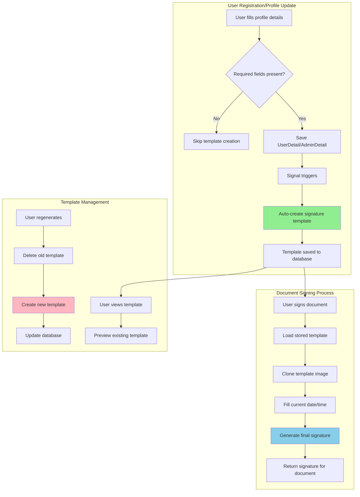

# Digital Signature Template System Documentation

## 🎯 **Overview**
The Digital Signature Template System provides automated generation and management of professional digital signatures for document signing workflows. The system creates personalized signature templates with company branding and dynamically fills date/time information during actual document signing.

## 🏗️ **System Architecture**

### **Core Components**
1. **Template Generator** - Creates professional signature images
2. **Database Models** - Stores templates and metadata
3. **API Layer** - RESTful endpoints for template management
4. **Frontend Components** - React-based UI for template interaction
5. **Signal Handlers** - Automatic template creation triggers
6. **Document Integration** - Real-time signature generation for documents

## 📊 **Process Flow Diagram**



## 🗄️ **Database Schema**

### **UserDetail Model**
```python
class UserDetail(models.Model):
    # ... existing fields ...
    signature_template = models.ImageField(upload_to='signature_templates/', null=True, blank=True)
    signature_template_data = models.JSONField(null=True, blank=True, help_text="Stores template configuration data")
    
    # Required fields for template creation:
    # user.name, user.surname, user.designation
```

### **AdminDetail Model**
```python
class AdminDetail(models.Model):
    # ... existing fields ...
    signature_template = models.ImageField(upload_to='admin_signature_templates/', null=True, blank=True)
    signature_template_data = models.JSONField(null=True, blank=True)
    
    # Required fields for template creation:
    # user.name (designation optional for admins)
```

### **Template Data Structure**
```json
{
    "user_id": 123,
    "full_name": "John Doe",
    "designation": "Safety Engineer",
    "company_name": "ABC Construction Ltd",
    "template_created_at": "2025-01-17T10:30:00Z",
    "template_version": "1.0",
    "template_type": "user" // or "admin"
}
```

## 🔄 **Automatic Template Creation Process**

### **1. Signal-Based Auto-Creation**

```python
@receiver(post_save, sender=UserDetail)
def create_signature_template_on_userdetail_save(sender, instance, created, **kwargs):
    """Automatically create signature template when UserDetail is saved"""
    try:
        user = instance.user
        
        # Validation: Check required fields
        if not (user.name and user.surname and user.designation):
            print(f"⚠️ Skipping signature template creation: Missing required fields")
            return
            
        # Skip if template already exists
        if instance.signature_template:
            print(f"ℹ️ Signature template already exists")
            return
            
        # Create template
        from .signature_template_generator import create_user_signature_template
        create_user_signature_template(instance)
        print(f"✅ Signature template created successfully")
        
    except Exception as e:
        print(f"❌ Error creating signature template: {e}")
```

### **2. Template Generation Logic**

```python
class SignatureTemplateGenerator:
    def __init__(self):
        self.template_width = 400
        self.template_height = 200
        self.logo_max_width = 80
        self.logo_max_height = 60
        
    def create_signature_template(self, user_detail):
        """Create professional signature template"""
        
        # 1. Create base canvas
        img = Image.new('RGBA', (self.template_width, self.template_height), (255, 255, 255, 0))
        draw = ImageDraw.Draw(img)
        
        # 2. Add company logo (if available)
        company_logo = self._get_company_logo(user_detail.user)
        if company_logo:
            # Resize and add as watermark with 20% opacity
            logo_resized = self._resize_logo(company_logo)
            logo_with_alpha = logo_resized.convert('RGBA')
            alpha = logo_with_alpha.split()[-1]
            alpha = alpha.point(lambda p: int(p * 0.2))
            logo_with_alpha.putalpha(alpha)
            img.paste(logo_with_alpha, (10, 10), logo_with_alpha)
        
        # 3. Add signature text elements
        full_name = f"{user_detail.user.name} {user_detail.user.surname}".strip()
        
        # "Digitally signed by" header
        draw.text((name_x, current_y), "Digitally signed by", font=small_font, fill=secondary_color)
        current_y += 15
        
        # User name
        draw.text((name_x, current_y), full_name, font=detail_font, fill=primary_color)
        current_y += 20
        
        # Date placeholder (filled dynamically during signing)
        draw.text((name_x, current_y), "Date: [TO_BE_FILLED]", font=small_font, fill=secondary_color)
        
        # 4. Save template
        return self._save_template(img, user_detail)
```

## 📡 **API Endpoints**

### **UserDetail Signature Templates**

| Method | Endpoint | Description |
|--------|----------|-------------|
| `POST` | `/authentication/signature/template/create/` | Create new signature template |
| `GET` | `/authentication/signature/template/preview/` | Get template preview |
| `GET` | `/authentication/signature/template/data/` | Get template configuration data |
| `PUT` | `/authentication/signature/template/regenerate/` | Regenerate existing template |
| `POST` | `/authentication/signature/generate/` | Generate signed document signature |

### **AdminDetail Signature Templates**

| Method | Endpoint | Description |
|--------|----------|-------------|
| `POST` | `/authentication/admin/signature/template/create/` | Create admin signature template |
| `GET` | `/authentication/admin/signature/template/preview/` | Get admin template preview |
| `GET` | `/authentication/admin/signature/template/data/` | Get admin template data |
| `PUT` | `/authentication/admin/signature/template/regenerate/` | Regenerate admin template |

### **API Response Examples**

#### **Template Creation Response**
```json
{
    "success": true,
    "message": "Signature template created successfully",
    "template_url": "/media/signature_templates/signature_template_123_20250117_103000.png",
    "template_data": {
        "user_id": 123,
        "full_name": "John Doe",
        "designation": "Safety Engineer",
        "company_name": "ABC Construction Ltd",
        "template_created_at": "2025-01-17T10:30:00Z",
        "template_version": "1.0"
    }
}
```

#### **Template Data Response**
```json
{
    "success": true,
    "can_create_template": true,
    "missing_fields": [],
    "user_data": {
        "full_name": "John Doe",
        "designation": "Safety Engineer",
        "company_name": "ABC Construction Ltd",
        "has_company_logo": true
    },
    "has_existing_template": true,
    "template_data": { /* template metadata */ }
}
```

## 🎨 **Frontend Integration**

### **React Component Usage**

```typescript
// In UserDetail form
<Form.Item label="Digital Signature Template" name="signatureTemplate">
    <DigitalSignatureTemplate
        disabled={isReadOnly}
        onTemplateCreated={() => {
            message.success('Digital signature template will be created automatically when you submit your details.');
        }}
    />
</Form.Item>
```

### **Template Management Component**

```typescript
const DigitalSignatureTemplate: React.FC<DigitalSignatureTemplateProps> = ({ 
    onTemplateCreated, 
    disabled 
}) => {
    const [templateInfo, setTemplateInfo] = useState<TemplateInfo | null>(null);
    const [templateUrl, setTemplateUrl] = useState<string | null>(null);
    const [loading, setLoading] = useState(false);
    const [creating, setCreating] = useState(false);

    // Fetch template information
    const fetchTemplateInfo = async () => {
        const response = await api.get('/authentication/signature/template/data/');
        setTemplateInfo(response.data);
        
        if (response.data.has_existing_template) {
            const previewResponse = await api.get('/authentication/signature/template/preview/');
            if (previewResponse.data.success) {
                setTemplateUrl(previewResponse.data.template_url);
            }
        }
    };

    // Create new signature template
    const createTemplate = async () => {
        const response = await api.post('/authentication/signature/template/create/');
        if (response.data.success) {
            message.success('Digital signature template created successfully!');
            setTemplateUrl(response.data.template_url);
            await fetchTemplateInfo();
            onTemplateCreated?.();
        }
    };
    
    // Component renders template status, preview, and management buttons
};
```

## 📝 **Document Signing Process**

### **1. Dynamic Signature Generation**

```python
def generate_signed_document_signature(self, user_detail, sign_datetime=None):
    """Generate signature for actual document signing with current date/time"""
    
    if not sign_datetime:
        sign_datetime = datetime.now()
        
    # Load the stored template
    if not user_detail.signature_template:
        raise ValueError("No signature template found for user")
        
    template_img = Image.open(user_detail.signature_template.path)
    signed_img = template_img.copy()
    draw = ImageDraw.Draw(signed_img)
    
    # Replace date placeholder with actual date/time
    date_text = f"Date: {sign_datetime.strftime('%Y-%m-%d %H:%M:%S %Z')}"
    
    # Clear the placeholder area
    draw.rectangle([(name_x, date_y), (self.template_width - 10, date_y + 20)], fill=(255, 255, 255))
    
    # Draw the actual date
    draw.text((name_x, date_y), date_text, font=small_font, fill=(100, 100, 100))
    
    # Return as ContentFile for document attachment
    img_io = io.BytesIO()
    signed_img.save(img_io, format='PNG', quality=95)
    img_io.seek(0)
    
    filename = f"signature_{user_detail.user.id}_{sign_datetime.strftime('%Y%m%d_%H%M%S')}.png"
    return ContentFile(img_io.getvalue(), name=filename)
```

### **2. Frontend Signature Hook**

```typescript
export const useDigitalSignature = () => {
    const [loading, setLoading] = useState(false);
    const [error, setError] = useState<string | null>(null);
    const { message } = App.useApp();

    const generateSignature = async (options: SignatureOptions = {}): Promise<string | null> => {
        setLoading(true);
        setError(null);

        try {
            const payload: any = {};
            
            if (options.customDateTime) {
                payload.sign_datetime = options.customDateTime;
            }

            const response = await api.post('/authentication/signature/generate/', payload, {
                responseType: 'blob' // Receiving image data
            });

            // Create blob URL for the signature image
            const blob = new Blob([response.data], { type: 'image/png' });
            const signatureUrl = URL.createObjectURL(blob);

            return signatureUrl;
        } catch (error: any) {
            const errorMessage = 'Failed to generate signature';
            setError(errorMessage);
            message.error(errorMessage);
            return null;
        } finally {
            setLoading(false);
        }
    };

    return { generateSignature, loading, error };
};
```

## 🔧 **Management & Maintenance**

### **1. Django Management Command**

```python
class Command(BaseCommand):
    help = 'Create signature templates for existing users'

    def add_arguments(self, parser):
        parser.add_argument('--dry-run', action='store_true', help='Show what would be created without actually creating')
        parser.add_argument('--force', action='store_true', help='Recreate existing templates')
        parser.add_argument('--user-type', choices=['userdetail', 'admindetail', 'both'], default='both')

    def handle(self, *args, **options):
        dry_run = options['dry_run']
        force = options['force']
        user_type = options['user_type']
        
        userdetail_created = 0
        admindetail_created = 0
        errors = 0

        # Process UserDetail instances
        if user_type in ['userdetail', 'both']:
            userdetails = UserDetail.objects.select_related('user').all()
            
            for user_detail in userdetails:
                user = user_detail.user
                
                # Check required fields
                if not (user.name and user.surname and user.designation):
                    continue
                    
                # Skip if template exists (unless force)
                if user_detail.signature_template and not force:
                    continue
                
                if dry_run:
                    self.stdout.write(self.style.SUCCESS(f"✅ Would create template for: {user.username}"))
                    userdetail_created += 1
                else:
                    try:
                        with transaction.atomic():
                            if force and user_detail.signature_template:
                                user_detail.signature_template.delete(save=False)
                                user_detail.signature_template_data = None
                            
                            create_user_signature_template(user_detail)
                            self.stdout.write(self.style.SUCCESS(f"✅ Created template for: {user.username}"))
                            userdetail_created += 1
                            
                    except Exception as e:
                        self.stdout.write(self.style.ERROR(f"❌ Error: {e}"))
                        errors += 1

        # Summary
        self.stdout.write(self.style.SUCCESS(f"\n📊 Summary:"))
        self.stdout.write(f"UserDetail templates: {userdetail_created}")
        self.stdout.write(f"AdminDetail templates: {admindetail_created}")
        self.stdout.write(f"Errors: {errors}")
```

### **2. Usage Commands**
```bash
# Create templates for all eligible users
python manage.py create_signature_templates

# Dry run to see what would be created
python manage.py create_signature_templates --dry-run

# Force recreate existing templates
python manage.py create_signature_templates --force

# Create only for UserDetail instances
python manage.py create_signature_templates --user-type userdetail
```

## 🛡️ **Security & Validation**

### **1. Required Field Validation**
- **UserDetail**: `name`, `surname`, `designation`
- **AdminDetail**: `name` (designation optional)
- **Company Information**: Optional but enhances template

### **2. File Security**
- Templates stored in secure media directories
- Proper file permissions and access controls
- Image format validation (PNG)

### **3. Error Handling**
- Graceful handling of missing fields
- Comprehensive logging for debugging
- User-friendly error messages
- Fallback mechanisms for template generation failures

## 📈 **Usage Statistics & Monitoring**

### **Template Creation Metrics**
- Track successful template creations
- Monitor failed attempts and reasons
- User adoption rates by role type
- Template regeneration frequency

### **Performance Considerations**
- Template generation is asynchronous via signals
- Image processing optimized for web delivery
- Efficient database queries with select_related
- Proper caching for frequently accessed templates

## 🔄 **Integration Examples**

### **1. Safety Observation Signing**
```python
# In safety observation workflow
signature_file = generate_document_signature(user_detail)
safety_observation.approver_signature.save(signature_file.name, signature_file)
```

### **2. Permit to Work Approval**
```python
# In PTW approval process
signature_file = generate_document_signature(admin_detail)
permit.approved_by_signature.save(signature_file.name, signature_file)
```

### **3. Meeting Minutes Acknowledgment**
```python
# In meeting minutes
signature_file = generate_document_signature(user_detail)
meeting_minute.participant_signatures.add(signature_file)
```

## 🚀 **Future Enhancements**

### **Planned Features**
1. **Multi-language Support** - Templates in different languages
2. **Custom Styling** - User-configurable template styles
3. **Batch Signing** - Sign multiple documents at once
4. **Digital Certificates** - Integration with PKI certificates
5. **Audit Trail** - Comprehensive signing history
6. **Mobile Optimization** - Enhanced mobile signature experience

### **Technical Improvements**
1. **Template Caching** - Redis-based template caching
2. **Image Optimization** - WebP format support
3. **Background Processing** - Celery-based template generation
4. **API Rate Limiting** - Prevent abuse of signature generation
5. **Template Versioning** - Track template changes over time

---

## 📞 **Support & Troubleshooting**

### **Common Issues**
1. **Missing Required Fields** - Ensure name, surname, designation are filled
2. **Template Not Generating** - Check signal handlers and logs
3. **Image Quality Issues** - Verify PIL/Pillow installation
4. **Permission Errors** - Check media directory permissions

### **Debug Commands**
```bash
# Check template status for specific user
python manage.py shell -c "from authentication.models import UserDetail; ud = UserDetail.objects.get(user__username='john'); print(f'Template: {ud.signature_template}, Data: {ud.signature_template_data}')"

# Regenerate templates with verbose output
python manage.py create_signature_templates --force --verbosity=2
```

---

**Document Version**: 1.0  
**Last Updated**: January 17, 2025  
**System Version**: EHS Management System v2.0
