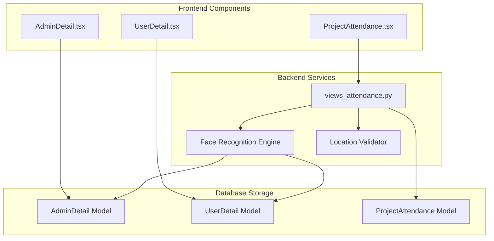
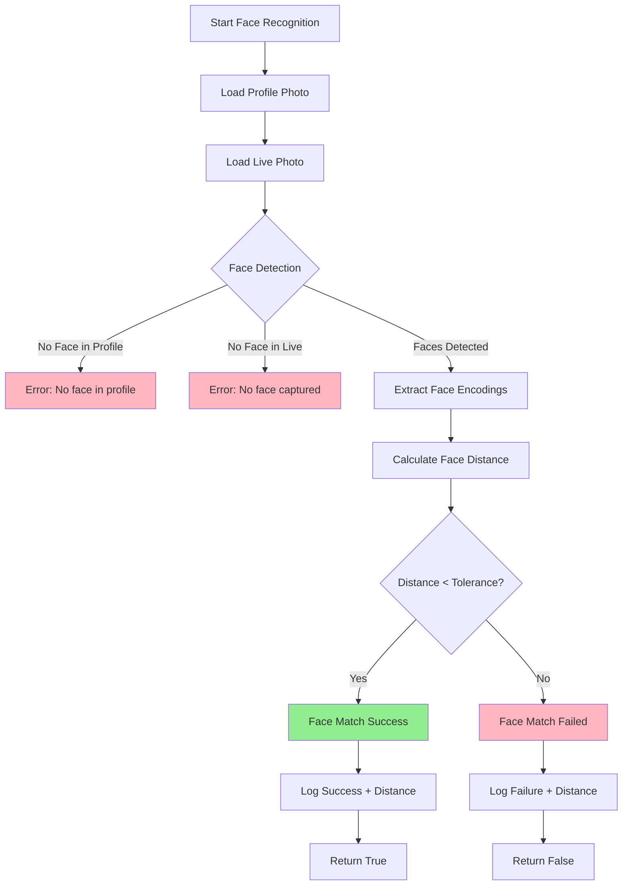

# Profile Photo Storage & Live Attendance Photo Comparison System

## 📋 Table of Contents
1. [System Overview](#system-overview)
2. [Profile Photo Storage](#profile-photo-storage)
3. [Live Attendance Photo Comparison](#live-attendance-photo-comparison)
4. [Backend Face Recognition System](#backend-face-recognition-system)
5. [Security Features](#security-features)
6. [Flow Diagrams](#flow-diagrams)
7. [Technical Implementation](#technical-implementation)
8. [API Endpoints](#api-endpoints)
9. [Error Handling](#error-handling)
10. [Troubleshooting Guide](#troubleshooting-guide)

## 🎯 System Overview

The EHS Management System implements a sophisticated **face recognition-based attendance system** that compares live-captured photos against stored profile photos to ensure secure and accurate attendance tracking.

### Key Components
- **Profile Photo Storage**: Secure storage of user/admin profile photos
- **Live Photo Capture**: Real-time photo capture during attendance
- **Face Recognition Engine**: ML-powered face comparison
- **Location Verification**: GPS-based proximity checking
- **Multi-layer Security**: Comprehensive validation system

## 📸 Profile Photo Storage

### 1. AdminDetail Component (`AdminDetail.tsx`)

**Purpose**: Profile photo management for project administrators

```typescript
// Storage Configuration
- Model: AdminDetail
- Field: photo (ImageField)
- Upload Path: 'admin_photos/'
- User Type: 'projectadmin'
- Capture Method: Webcam (react-webcam)
- File Format: JPEG from dataURL
```

**Key Features**:
- ✅ Live webcam capture with preview
- ✅ File upload support
- ✅ Photo validation and compression
- ✅ Approval workflow integration
- ✅ Real-time preview with thumbnails

### 2. UserDetail Component (`userdetail.tsx`)

**Purpose**: Profile photo management for regular users

```typescript
// Storage Configuration
- Model: UserDetail  
- Field: photo (ImageField)
- Upload Path: 'user_photos/'
- User Type: 'adminuser'
- Capture Method: Webcam (react-webcam)
- File Format: JPEG from dataURL
```

**Key Features**:
- ✅ Mandatory photo requirement
- ✅ Live webcam capture
- ✅ Form validation integration
- ✅ Approval workflow
- ✅ Photo quality validation

## 🎯 Live Attendance Photo Comparison

### ProjectAttendance Component (`ProjectAttendance.tsx`)

**Purpose**: Real-time attendance marking with face verification

```typescript
// Capture Configuration
- Capture Method: HTML5 Canvas from video stream
- File Format: JPEG blob (0.8 quality)
- Resolution: 640x480 pixels
- Camera: Front-facing (user)
- Storage: Temporary FormData for API submission
```

**Attendance Flow**:
1. **Location Check**: GPS coordinates validation
2. **Camera Access**: Request camera permissions
3. **Live Preview**: Real-time video stream
4. **Photo Capture**: Canvas-based image capture
5. **Face Verification**: Backend comparison
6. **Attendance Record**: Database storage

## 🔍 Backend Face Recognition System

### Core Algorithm (`views_attendance.py`)

#### 1. Photo Retrieval Logic

```python
def get_profile_photo(user):
    """Retrieve stored profile photo based on user type"""
    
    if user.user_type == 'projectadmin':
        # Admin profile photo
        admin_detail = AdminDetail.objects.get(user=user)
        return admin_detail.photo.path
        
    elif user.user_type == 'adminuser':
        # User profile photo  
        user_detail = UserDetail.objects.get(user=user)
        return user_detail.photo.path
        
    else:
        raise ValueError("Invalid user type for attendance")
```

#### 2. Advanced Face Recognition

```python
def compare_faces_advanced(known_image_path, unknown_image_file, tolerance=0.6):
    """
    ML-powered face comparison using face_recognition library
    
    Args:
        known_image_path: Stored profile photo path
        unknown_image_file: Live captured photo
        tolerance: Matching strictness (0.0-1.0)
    
    Returns:
        bool: True if faces match within tolerance
    """
    
    # Load images
    known_image = face_recognition.load_image_file(known_image_path)
    unknown_image = np.array(Image.open(BytesIO(image_data)))
    
    # Extract face encodings (128-dimensional vectors)
    known_encodings = face_recognition.face_encodings(known_image)
    unknown_encodings = face_recognition.face_encodings(unknown_image)
    
    # Validate face detection
    if len(known_encodings) == 0:
        raise ValueError("No face detected in profile photo")
    if len(unknown_encodings) == 0:
        raise ValueError("No face detected in captured photo")
    
    # Compare faces using Euclidean distance
    matches = face_recognition.compare_faces(
        [known_encodings[0]], 
        unknown_encodings[0], 
        tolerance=tolerance
    )
    
    # Calculate similarity score
    face_distance = face_recognition.face_distance(
        [known_encodings[0]], 
        unknown_encodings[0]
    )[0]
    
    # Log results for debugging
    logger.info(f"Face match: {matches[0]}, Distance: {face_distance:.3f}")
    
    return matches[0]
```

#### 3. Tolerance Configuration

```python
# Dynamic tolerance based on user type
tolerance = 0.5 if user.user_type == 'projectadmin' else 0.6

# Tolerance Scale:
# 0.0 - 0.4: Very Strict (identical faces only)
# 0.4 - 0.6: Strict (same person, different conditions)  
# 0.6 - 0.8: Moderate (allows lighting/angle variations)
# 0.8 - 1.0: Lenient (may allow similar-looking people)
```

## 🛡️ Security Features

### Multi-Layer Validation System

#### 1. Face Detection Layer
```python
✅ Detects presence of human faces in both images
✅ Validates face quality and clarity
✅ Ensures single face per image
✅ Checks face positioning and size
```

#### 2. Face Recognition Layer  
```python
✅ Extracts 128-dimensional face encodings
✅ Compares facial features using ML algorithms
✅ Calculates similarity scores
✅ Applies tolerance thresholds
```

#### 3. Location Verification Layer
```python
✅ GPS coordinate validation
✅ 300-meter radius enforcement
✅ Project site boundary checking
✅ High-accuracy GPS requirements
```

#### 4. Temporal Validation Layer
```python
✅ Prevents duplicate check-ins
✅ Enforces check-out before re-entry
✅ Daily attendance limits
✅ Time-based restrictions
```

### Fallback Security System

```python
# Primary: Advanced Face Recognition
if FACE_RECOGNITION_AVAILABLE:
    return compare_faces_advanced(known_path, unknown_file, tolerance)
    
# Fallback: Basic Face Detection + Strict Validation
else:
    logger.warning("Using basic face detection fallback")
    return compare_faces_basic_strict(known_path, unknown_file)
```

## 📊 Flow Diagrams

### 1. Overall System Architecture



### 2. Profile Photo Storage Flow

```mermaid
sequenceDiagram
    participant U as User
    participant F as Frontend
    participant B as Backend
    participant DB as Database
    participant FS as File System
    
    U->>F: Open Profile Page
    F->>B: GET /admin/me/ or /userdetail/
    B->>DB: Fetch existing data
    DB-->>B: Return profile data
    B-->>F: Profile data + photo URLs
    
    U->>F: Capture/Upload Photo
    F->>F: Convert to File object
    F->>B: PUT /admin/detail/update/ (FormData)
    B->>FS: Save photo file
    B->>DB: Update photo path
    DB-->>B: Confirm save
    B-->>F: Success response
    F-->>U: Photo saved confirmation

### 3. Live Attendance Verification Flow

```mermaid
sequenceDiagram
    participant U as User
    participant F as Frontend
    participant B as Backend
    participant FR as Face Recognition
    participant GPS as GPS Service
    participant DB as Database

    U->>F: Click Check In/Out
    F->>GPS: Request location
    GPS-->>F: GPS coordinates
    F->>F: Validate location accuracy

    alt Location Valid
        F->>U: Open camera modal
        U->>F: Capture photo
        F->>F: Convert to blob
        F->>B: POST /attendance/check-in/ (FormData)

        B->>DB: Get profile photo path
        DB-->>B: Return photo path

        B->>FR: Compare faces
        FR->>FR: Extract face encodings
        FR->>FR: Calculate similarity
        FR-->>B: Match result + score

        alt Face Match Success
            B->>DB: Save attendance record
            DB-->>B: Confirm save
            B-->>F: Success response
            F-->>U: Attendance marked
        else Face Match Failed
            B-->>F: Face recognition error
            F-->>U: Show error message
        end
    else Location Invalid
        F-->>U: Location error
    end
```

### 4. Face Recognition Algorithm Flow



## 🔧 Technical Implementation

### File Storage Structure

```
project_root/
├── media/
│   ├── admin_photos/              # AdminDetail profile photos
│   │   ├── admin_123_photo.jpg
│   │   ├── admin_456_photo.jpg
│   │   └── ...
│   ├── user_photos/               # UserDetail profile photos
│   │   ├── user_789_photo.jpg
│   │   ├── user_012_photo.jpg
│   │   └── ...
│   └── attendance_photos/         # Live attendance photos
│       ├── check_in/
│       │   ├── attendance_345_checkin_20250117.jpg
│       │   └── attendance_678_checkin_20250117.jpg
│       └── check_out/
│           ├── attendance_345_checkout_20250117.jpg
│           └── attendance_678_checkout_20250117.jpg
```

### Database Schema

#### AdminDetail Model
```python
class AdminDetail(models.Model):
    user = models.OneToOneField(CustomUser, on_delete=models.CASCADE)
    name = models.CharField(max_length=255)
    company_name = models.CharField(max_length=255)
    phone_number = models.CharField(max_length=15)
    photo = models.ImageField(upload_to='admin_photos/', null=True, blank=True)
    is_approved = models.BooleanField(default=False)
    created_at = models.DateTimeField(auto_now_add=True)
```

#### UserDetail Model
```python
class UserDetail(models.Model):
    user = models.OneToOneField(CustomUser, on_delete=models.CASCADE)
    employee_id = models.CharField(max_length=50)
    name = models.CharField(max_length=255)
    photo = models.ImageField(upload_to='user_photos/', null=True, blank=True)
    is_approved = models.BooleanField(default=False)
    created_at = models.DateTimeField(auto_now_add=True)
```

#### ProjectAttendance Model
```python
class ProjectAttendance(models.Model):
    user = models.ForeignKey(CustomUser, on_delete=models.CASCADE)
    project = models.ForeignKey(Project, on_delete=models.CASCADE)
    check_in_time = models.DateTimeField(null=True, blank=True)
    check_out_time = models.DateTimeField(null=True, blank=True)
    check_in_photo = models.ImageField(upload_to='attendance_photos/check_in/')
    check_out_photo = models.ImageField(upload_to='attendance_photos/check_out/')
    check_in_latitude = models.FloatField(null=True, blank=True)
    check_in_longitude = models.FloatField(null=True, blank=True)
    status = models.CharField(max_length=20, default='not_checked_in')
```

### Required Libraries

#### Backend Dependencies
```python
# Core face recognition
face_recognition==1.3.0
dlib>=19.22.0

# Image processing
opencv-python==4.8.1.78
Pillow==11.2.1
numpy>=1.21.0

# Django components
Django==5.2.1
djangorestframework==3.16.0
```

#### Frontend Dependencies
```typescript
// Camera and media handling
react-webcam: "^7.1.1"

// UI components
antd: "^5.0.0"
@ant-design/icons: "^5.0.0"

// Image processing
canvas: "^2.11.2"
```

## 🌐 API Endpoints

### Profile Photo Management

#### Admin Profile Photo
```http
PUT /authentication/admin/detail/update/projectadmin/
Content-Type: multipart/form-data

FormData:
- name: string
- phone_number: string
- photo: File (image)
- company_name: string
```

#### User Profile Photo
```http
PUT /authentication/userdetail/
Content-Type: multipart/form-data

FormData:
- employee_id: string
- name: string
- photo: File (image)
- mobile: string
- [other user fields]
```

### Attendance Endpoints

#### Check In
```http
POST /authentication/api/attendance/check-in/
Content-Type: multipart/form-data

FormData:
- project_id: integer
- latitude: float
- longitude: float
- photo: File (image)
```

#### Check Out
```http
POST /authentication/api/attendance/check-out/
Content-Type: multipart/form-data

FormData:
- project_id: integer
- latitude: float
- longitude: float
- photo: File (image)
```

#### Get Attendance Status
```http
GET /authentication/api/attendance/status/{project_id}/

Response:
{
  "status": "checked_in|checked_out|not_checked_in",
  "check_in_time": "2025-01-17T09:00:00Z",
  "check_out_time": null
}

## ⚠️ Error Handling

### Common Error Scenarios

#### 1. Face Recognition Errors
```python
# No face detected in profile photo
{
  "error": "No face detected in stored profile image",
  "code": "FACE_NOT_FOUND_PROFILE"
}

# No face detected in live photo
{
  "error": "No face detected in captured image",
  "code": "FACE_NOT_FOUND_LIVE"
}

# Face mismatch
{
  "error": "Face Recognition Failed: Your face does not match with the photo in our database. Please ensure good lighting, face the camera directly, and try again.",
  "code": "FACE_MISMATCH"
}
```

#### 2. Location Errors
```python
# User too far from project site
{
  "error": "Location Error: You are too far from the project site. Please move closer (within 300 meters) and try again.",
  "code": "LOCATION_OUT_OF_RANGE"
}

# Project location not configured
{
  "error": "Project Setup Error: Project location coordinates are not configured. Please contact administrator.",
  "code": "PROJECT_LOCATION_MISSING"
}
```

#### 3. Profile Errors
```python
# Missing profile photo
{
  "error": "Profile Photo Missing: Please update your profile photo first before marking attendance.",
  "code": "PROFILE_PHOTO_MISSING"
}

# Profile not found
{
  "error": "Profile Missing: Please complete your profile first before marking attendance.",
  "code": "PROFILE_NOT_FOUND"
}
```

#### 4. Attendance State Errors
```python
# Already checked in
{
  "error": "User already checked in. Please check out before checking in again.",
  "code": "ALREADY_CHECKED_IN"
}

# Already checked out
{
  "error": "You are already checked out for today. Cannot check in again.",
  "code": "ALREADY_CHECKED_OUT"
}
```

### Frontend Error Handling

#### Camera Access Errors
```typescript
// Permission denied
"Camera access denied. Please allow camera permissions and try again."

// Camera not found
"No camera found on this device."

// Camera in use
"Camera is already in use by another application."

// Browser not supported
"Camera not supported on this device or browser."
```

#### GPS Errors
```typescript
// Permission denied
"📍 Location Permission Denied: Please allow location access and try again."

// Position unavailable
"📍 Location Unavailable: Your location information is unavailable. Please check your GPS settings."

// Timeout
"📍 Location Timeout: Location request timed out. Please try again."

// Low accuracy warning
"GPS accuracy is 150m. For better accuracy, move to an open area."
```

## 🔧 Troubleshooting Guide

### 1. Face Recognition Issues

#### Problem: "No face detected in stored profile image"
**Solutions:**
- ✅ Ensure profile photo shows clear face
- ✅ Re-upload profile photo with better lighting
- ✅ Use front-facing photo without sunglasses/masks
- ✅ Check image file is not corrupted

#### Problem: "Face Recognition Failed" (faces don't match)
**Solutions:**
- ✅ Ensure good lighting during attendance
- ✅ Face camera directly without tilting
- ✅ Remove sunglasses, hats, or masks
- ✅ Try multiple times with different angles
- ✅ Update profile photo if appearance changed significantly

#### Problem: Face recognition library not available
**Solutions:**
- ✅ Install required packages: `pip install face-recognition dlib opencv-python`
- ✅ Check system has cmake and build tools
- ✅ Restart Django server after installation
- ✅ Verify installation with test script

### 2. Location Issues

#### Problem: "Location Error: You are too far from project site"
**Solutions:**
- ✅ Move physically closer to project site (within 300m)
- ✅ Check GPS accuracy (should be <50m for best results)
- ✅ Move to open area for better GPS signal
- ✅ Wait for GPS to stabilize before attempting

#### Problem: GPS accuracy too low
**Solutions:**
- ✅ Move away from buildings/tunnels
- ✅ Enable high-accuracy location mode
- ✅ Wait 30-60 seconds for GPS to stabilize
- ✅ Restart location services if needed

### 3. Camera Issues

#### Problem: Camera not working
**Solutions:**
- ✅ Grant camera permissions in browser
- ✅ Close other applications using camera
- ✅ Try different browser (Chrome recommended)
- ✅ Check camera hardware functionality
- ✅ Clear browser cache and cookies

#### Problem: Photo capture fails
**Solutions:**
- ✅ Wait for camera preview to load completely
- ✅ Ensure good lighting conditions
- ✅ Try capturing multiple times
- ✅ Check browser console for errors
- ✅ Refresh page and try again

### 4. Performance Optimization

#### Backend Optimization
```python
# Optimize image processing
- Resize images to standard dimensions (640x480)
- Compress images before processing
- Cache face encodings for frequent users
- Use async processing for large images
```

#### Frontend Optimization
```typescript
// Optimize camera handling
- Set appropriate video constraints
- Release camera resources properly
- Implement loading states
- Add retry mechanisms
```

## 📋 System Requirements

### Backend Requirements
```
Python >= 3.8
Django >= 5.0
OpenCV >= 4.5
dlib >= 19.22
face_recognition >= 1.3.0
Pillow >= 8.0
numpy >= 1.21
```

### Frontend Requirements
```
React >= 18.0
TypeScript >= 4.5
Antd >= 5.0
react-webcam >= 7.0
Modern browser with camera support
```

### Hardware Requirements
```
Camera: Front-facing camera (minimum 640x480)
GPS: High-accuracy GPS capability
Storage: Sufficient space for photo storage
Network: Stable internet connection
```

## 🚀 Deployment Considerations

### Production Setup
1. **Configure proper media storage** (AWS S3, local storage)
2. **Set up Redis for caching** face encodings
3. **Configure HTTPS** for camera access
4. **Set up monitoring** for face recognition performance
5. **Implement backup strategy** for photos
6. **Configure log rotation** for debug logs

### Security Recommendations
1. **Encrypt stored photos** at rest
2. **Implement rate limiting** for attendance attempts
3. **Add audit logging** for all attendance actions
4. **Regular security updates** for face recognition libraries
5. **Monitor for suspicious patterns** in attendance data

---

## 📞 Support

For technical support or questions about this system:
- Check the troubleshooting guide above
- Review server logs for detailed error messages
- Test face recognition with the provided test script
- Contact system administrator for profile-related issues

---

**Document Version**: 1.0
**Last Updated**: January 17, 2025
**System Version**: EHS Management System v2.0
```
```
