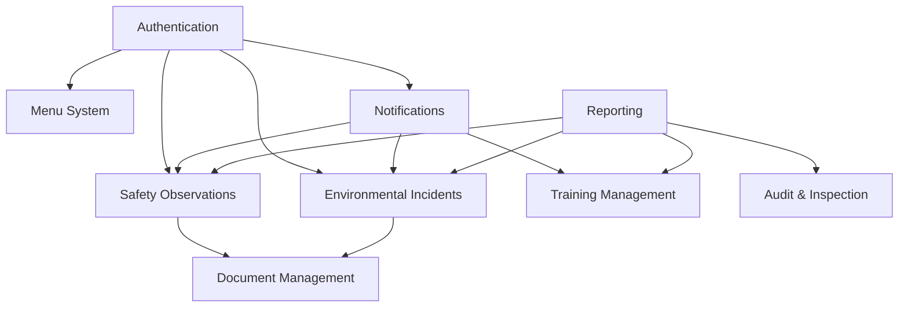

# Athens EHS System - Complete Technical Blueprint Index

## System Overview
Athens EHS (Environmental, Health & Safety) is a comprehensive enterprise-grade system for managing workplace safety, environmental compliance, and operational excellence across multiple projects and organizations.

## Architecture Summary

### Core Technology Stack
- **Backend**: Django REST Framework with PostgreSQL
- **Frontend**: React with TypeScript and Vite
- **Authentication**: JWT-based with multi-tenant project isolation
- **File Storage**: Django FileField with organized directory structure
- **Notifications**: Real-time notification system with database persistence
- **Deployment**: Docker containerization with Nginx reverse proxy

### System-Wide Design Principles
1. **Project Isolation**: Strict data segregation by project/tenant
2. **Role-Based Access Control**: Granular permissions with escalation handling
3. **Audit Trail**: Complete tracking of all data changes
4. **Notification-Driven Workflows**: Real-time updates and assignments
5. **Mobile-First Design**: Responsive interfaces for field operations
6. **Scalable Architecture**: Modular design for enterprise growth

## Module Blueprint Index

### 1. [Authentication & User Management Module](AUTHENTICATION_MODULE_BLUEPRINT.md)
**Status**: ✅ Complete Blueprint Available
- Multi-tenant project isolation system
- JWT authentication with refresh tokens
- Role-based permissions (Master Admin, Project Admin, User)
- User profile management with induction training tracking
- Project assignment and access control

### 2. [Menu & Navigation Module](MENU_MODULE_BLUEPRINT.md)
**Status**: ✅ Complete Blueprint Available
- Dynamic menu system with project-based configuration
- Module access control per project
- Hierarchical navigation structure
- Real-time menu updates based on permissions
- Admin interface for menu management

### 3. [Notification System Module](NOTIFICATION_SYSTEM_MODULE_BLUEPRINT.md)
**Status**: ✅ Complete Blueprint Available
- Real-time notification delivery system
- Multi-channel notification support (in-app, email, SMS)
- Notification templates and personalization
- Read/unread status tracking
- Bulk notification management

### 4. [Safety Observation Module](SAFETY_OBSERVATION_MODULE_BLUEPRINT.md)
**Status**: ✅ Complete Blueprint Available
- Comprehensive safety observation reporting
- Risk assessment with auto-escalation
- Workflow management (Open → In Progress → Closed)
- File attachment system for photos
- Assignment and approval workflows

### 5. [Incident Management Module](INCIDENT_MANAGEMENT_MODULE_BLUEPRINT.md)
**Status**: ✅ Complete Blueprint Available
- Comprehensive incident reporting with 8D problem-solving methodology
- Risk assessment with probability/impact matrix
- Cost tracking and financial impact analysis
- Regulatory compliance and audit trails
- Lessons learned and knowledge management

### 6. [Induction Training Module](INDUCTION_TRAINING_MODULE_BLUEPRINT.md)
**Status**: ✅ Complete Blueprint Available
- Face recognition attendance verification system
- Digital signature authorization workflow
- ISO compliance documentation
- EPC Safety Department access control
- Employment status integration

### 7. [Permission & Escalation Engine](PERMISSION_ESCALATION_ENGINE_MODULE_BLUEPRINT.md)
**Status**: ✅ Complete Blueprint Available
- Centralized permission management with escalation-based access control
- Temporary permission grants with approval workflows
- Time-limited access (15-minute windows)
- Creator bypass and escalation restrictions

### 8. [Project Isolation Core](PROJECT_ISOLATION_CORE_MODULE_BLUEPRINT.md)
**Status**: ✅ Complete Blueprint Available
- Multi-tenant data isolation system
- Project-level and company-level (tenant) isolation
- Automatic query filtering and middleware enforcement
- Master user bypass functionality

### 9. [Dashboard & Analytics Engine](DASHBOARD_ANALYTICS_MODULE_BLUEPRINT.md)
**Status**: ✅ Complete Blueprint Available
- Real-time KPIs with percentage change calculations
- Cross-module analytics and trend analysis
- Project-specific and system-wide views
- Recent activity feed and status distribution charts

### 10. Environmental Incident Module
**Status**: 🔄 Blueprint In Progress
- Environmental incident reporting and tracking
- Regulatory compliance management
- Environmental impact assessment
- Integration with safety observations
- Corrective action tracking

### 11. Training Management Module
**Status**: 📋 Pending Analysis
- Training program management
- Competency tracking and certification
- Training schedule and calendar
- Progress monitoring and reporting
- Integration with user profiles

### 12. Audit & Inspection Module
**Status**: 📋 Pending Analysis
- Audit planning and scheduling
- Inspection checklist management
- Finding tracking and closure
- Compliance monitoring
- Audit report generation

### 13. Document Management Module
**Status**: 📋 Pending Analysis
- Document version control
- Access control and permissions
- Document approval workflows
- Search and categorization
- Compliance document tracking

### 14. Reporting & Analytics Module
**Status**: 📋 Pending Analysis
- Dashboard and KPI monitoring
- Custom report builder
- Data visualization and charts
- Trend analysis and forecasting
- Regulatory reporting automation

## System Integration Architecture

### Inter-Module Dependencies


### Data Flow Architecture
1. **Authentication Layer**: Project isolation and user context
2. **Business Logic Layer**: Module-specific operations and workflows
3. **Notification Layer**: Cross-module communication and alerts
4. **Data Persistence Layer**: Project-isolated data storage
5. **Presentation Layer**: Responsive UI with real-time updates

## Project Isolation Implementation

### Database Level Isolation
```python
# Every model includes project foreign key
class BaseModel(models.Model):
    project = models.ForeignKey('authentication.Project', on_delete=models.CASCADE)
    created_at = models.DateTimeField(auto_now_add=True)
    updated_at = models.DateTimeField(auto_now=True)
    created_by = models.ForeignKey(AUTH_USER_MODEL, on_delete=models.CASCADE)
    
    class Meta:
        abstract = True
```

### ViewSet Level Isolation
```python
class ProjectIsolationMixin:
    def get_queryset(self):
        user = self.request.user
        if user.is_superuser or user.admin_type == 'master':
            return self.model.objects.all()
        
        if not user.project:
            return self.model.objects.none()
        
        return self.model.objects.filter(project_id=user.project.id)
```

### Frontend Context Isolation
```typescript
// Project context provider
const ProjectContext = createContext<ProjectContextType>({
  currentProject: null,
  userPermissions: [],
  availableModules: []
});
```

## Security Framework

### Authentication Security
- JWT tokens with configurable expiration
- Refresh token rotation
- Session management and logout
- Password policy enforcement
- Multi-factor authentication support

### Authorization Security
- Role-based access control (RBAC)
- Project-level permissions
- Module-specific permissions
- Object-level permissions
- Escalation-based access restrictions

### Data Security
- Project-based data isolation
- Encrypted sensitive data storage
- Audit logging for all operations
- File upload security and validation
- SQL injection prevention

## API Architecture

### RESTful API Design
```
/api/v1/
├── auth/                    # Authentication endpoints
├── users/                   # User management
├── projects/                # Project management
├── menu/                    # Menu configuration
├── notifications/           # Notification system
├── safetyobservation/       # Safety observations
├── environmental/           # Environmental incidents
├── training/                # Training management
├── audits/                  # Audit & inspection
├── documents/               # Document management
└── reports/                 # Reporting & analytics
```

### API Standards
- Consistent response formats
- Proper HTTP status codes
- Pagination for list endpoints
- Filtering and search capabilities
- API versioning support

## File Management System

### Directory Structure
```
media/
├── user_profiles/           # User profile images
├── safety_observation_files/# Safety observation attachments
├── environmental_files/     # Environmental incident files
├── training_materials/      # Training documents and media
├── audit_files/            # Audit and inspection files
├── documents/              # General document storage
└── reports/                # Generated report files
```

### File Security
- Project-based file access control
- File type validation and restrictions
- Virus scanning for uploads
- Secure file serving with authentication
- File versioning and backup

## Notification System Architecture

### Notification Types
1. **Assignment Notifications**: Task/observation assignments
2. **Status Change Notifications**: Workflow state changes
3. **Deadline Notifications**: Due date reminders
4. **Escalation Notifications**: Auto-escalation alerts
5. **System Notifications**: System maintenance and updates

### Delivery Channels
- **In-App**: Real-time browser notifications
- **Email**: SMTP-based email delivery
- **SMS**: Third-party SMS gateway integration
- **Push**: Mobile app push notifications (future)

## Performance & Scalability

### Database Optimization
- Proper indexing strategy
- Query optimization with select_related/prefetch_related
- Database connection pooling
- Read replica support for reporting

### Caching Strategy
- Redis-based session caching
- API response caching
- Static file caching with CDN
- Database query result caching

### Monitoring & Logging
- Application performance monitoring
- Error tracking and alerting
- User activity logging
- System health monitoring

## Deployment Architecture

### Container Strategy
```yaml
# docker-compose.yml structure
services:
  backend:          # Django application
  frontend:         # React application
  database:         # PostgreSQL
  redis:           # Caching and sessions
  nginx:           # Reverse proxy and static files
  celery:          # Background task processing
```

### Environment Management
- Development environment with hot reload
- Staging environment for testing
- Production environment with high availability
- Environment-specific configuration management

## Quality Assurance

### Testing Strategy
- Unit tests for business logic
- Integration tests for API endpoints
- End-to-end tests for critical workflows
- Performance testing for scalability
- Security testing for vulnerabilities

### Code Quality
- ESLint and Prettier for frontend
- Black and isort for backend
- Type checking with TypeScript and mypy
- Code review process with pull requests
- Automated CI/CD pipeline

## Compliance & Regulatory

### Data Protection
- GDPR compliance for EU operations
- Data retention and deletion policies
- Privacy by design principles
- Consent management system

### Industry Standards
- ISO 45001 (Occupational Health and Safety)
- ISO 14001 (Environmental Management)
- OSHA compliance (US operations)
- Local regulatory compliance

## Future Roadmap

### Phase 1 (Current): Core Modules
- ✅ Authentication & User Management
- ✅ Menu & Navigation System
- ✅ Notification System
- ✅ Safety Observation Module
- ✅ Incident Management Module
- ✅ Induction Training Module
- 🔄 Environmental Incident Module

### Phase 2: Operational Modules
- 📋 Incident Management Module
- 📋 Training Management Module
- 📋 Audit & Inspection Module

### Phase 3: Advanced Features
- 📋 Document Management Module
- 📋 Reporting & Analytics Module
- 📋 Mobile Application
- 📋 AI/ML Integration

### Phase 4: Enterprise Features
- 📋 Multi-Language Support
- 📋 Advanced Analytics & BI
- 📋 Third-Party Integrations
- 📋 API Marketplace

## Development Guidelines

### Code Standards
- Follow PEP 8 for Python code
- Use TypeScript strict mode
- Implement proper error handling
- Write comprehensive documentation
- Follow security best practices

### Git Workflow
- Feature branch development
- Pull request reviews
- Automated testing on commits
- Semantic versioning
- Release branch management

### Documentation Requirements
- API documentation with OpenAPI/Swagger
- User manuals and guides
- Technical architecture documentation
- Deployment and maintenance guides
- Security and compliance documentation

## 📚 Complete Documentation Library

### ✅ Baseline v1.0 - Fully Documented (10 Modules)
1. **[ATHENS_BASELINE_v1.0.md](ATHENS_BASELINE_v1.0.md)** - Baseline Release & Change Control
2. **[SYSTEM_DEBUG_PLAYBOOK.md](SYSTEM_DEBUG_PLAYBOOK.md)** - Emergency Response & Troubleshooting
3. **[AUTHENTICATION_AUTHORIZATION_MODULE_BLUEPRINT.md](AUTHENTICATION_AUTHORIZATION_MODULE_BLUEPRINT.md)** - Core Authentication
4. **[MENU_MANAGEMENT_MODULE_BLUEPRINT.md](MENU_MANAGEMENT_MODULE_BLUEPRINT.md)** - Dynamic Navigation
5. **[NOTIFICATION_SYSTEM_MODULE_BLUEPRINT.md](NOTIFICATION_SYSTEM_MODULE_BLUEPRINT.md)** - Real-time Alerts
6. **[SAFETY_OBSERVATION_MODULE_BLUEPRINT.md](SAFETY_OBSERVATION_MODULE_BLUEPRINT.md)** - Safety Reporting
7. **[INCIDENT_MANAGEMENT_MODULE_BLUEPRINT.md](INCIDENT_MANAGEMENT_MODULE_BLUEPRINT.md)** - 8D Problem Solving
8. **[INDUCTION_TRAINING_MODULE_BLUEPRINT.md](INDUCTION_TRAINING_MODULE_BLUEPRINT.md)** - Face Recognition Training
9. **[PERMISSION_ESCALATION_ENGINE_MODULE_BLUEPRINT.md](PERMISSION_ESCALATION_ENGINE_MODULE_BLUEPRINT.md)** - Access Control
10. **[PROJECT_ISOLATION_CORE_MODULE_BLUEPRINT.md](PROJECT_ISOLATION_CORE_MODULE_BLUEPRINT.md)** - Multi-tenant Isolation
11. **[DASHBOARD_ANALYTICS_MODULE_BLUEPRINT.md](DASHBOARD_ANALYTICS_MODULE_BLUEPRINT.md)** - Analytics Engine
12. **[ATHENS_SYSTEM_BLUEPRINT_INDEX.md](ATHENS_SYSTEM_BLUEPRINT_INDEX.md)** - This Index

---

## Quick Reference Links

- [System Setup Guide](README.md)
- [Docker Setup Guide](DOCKER_SETUP_GUIDE.md)
- [API Documentation](API_DOCUMENTATION.md)
- [Security Guidelines](SECURITY_GUIDELINES.md)
- [Troubleshooting Guide](MIXED_CONTENT_TROUBLESHOOTING.md)

**Last Updated**: January 2025
**Version**: 1.0.0
**Status**: Active Development