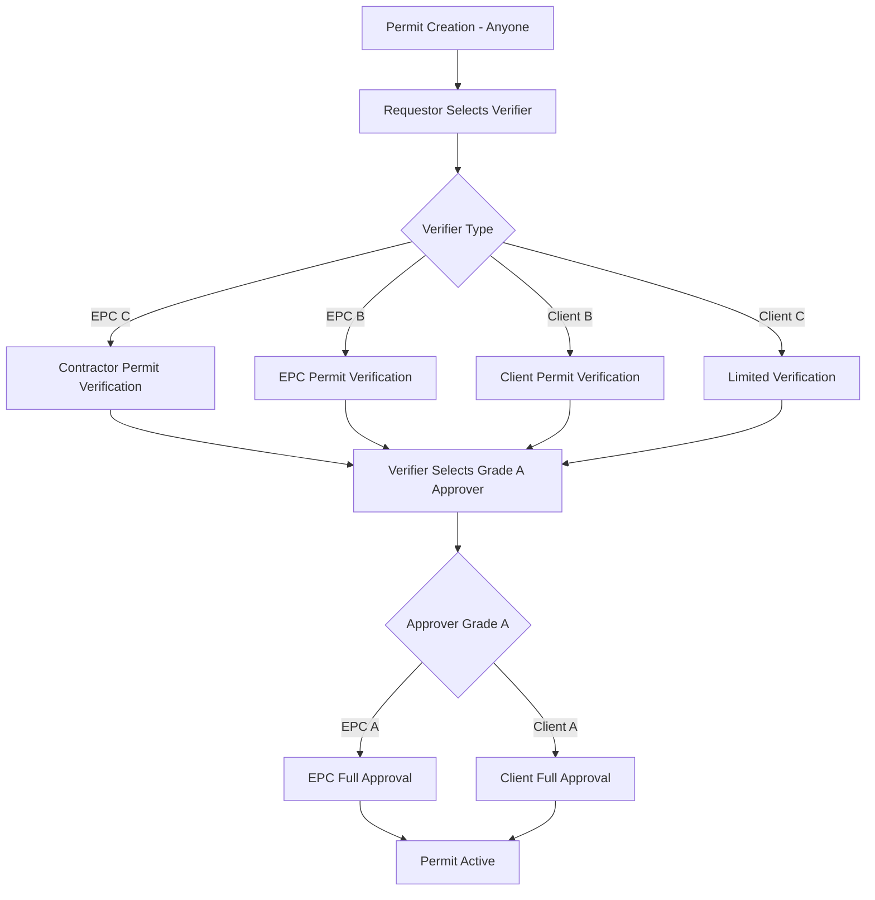

# PTW Grade-Based Workflow Blueprint

## Overview
This document serves as the definitive blueprint for the grade-based Permit to Work (PTW) workflow system implemented in the Athens EHS platform.

## Workflow Architecture

### User Grade Matrix

| User Type | Grade | Create | Verify | Approve | Specialization |
|-----------|-------|--------|--------|---------|----------------|
| **EPC** | C | ✅ | ✅ (Contractor permits) | ❌ | Contractor permit specialist |
| **EPC** | B | ✅ | ✅ (EPC permits) | ❌ | EPC permit specialist |
| **EPC** | A | ✅ | ✅ | ✅ | Full approval authority |
| **Client** | C | ✅ | ✅ (Limited) | ❌ | Basic verification |
| **Client** | B | ✅ | ✅ (Client permits) | ❌ | Client permit specialist |
| **Client** | A | ✅ | ✅ | ✅ | Full approval authority |
| **Contractor** | All | ✅ | ❌ | ❌ | Permit creation only |

## Workflow Process Flow



## Selection Rules Engine

### Verifier Selection Logic
```python
def get_available_verifiers(requestor_type, requestor_grade, permit_type):
    if requestor_type == 'contractoruser':
        # Contractor permits → EPC C grade (specialized)
        return filter(admin_type='epcuser', grade='C') + filter(admin_type='clientuser', grade=['B','C'])
    
    elif requestor_type == 'epcuser':
        # EPC permits → EPC B grade (specialized)
        return filter(admin_type='epcuser', grade=['B','C']) + filter(admin_type='clientuser', grade=['B','C'])
    
    elif requestor_type == 'clientuser':
        # Client permits → Client B grade (specialized)
        return filter(admin_type='clientuser', grade=['B','C'])
```

### Approver Selection Logic
```python
def get_available_approvers(verifier_type, verifier_grade):
    if verifier_type == 'clientuser':
        # Client verifiers → Client A grade only
        return filter(admin_type='clientuser', grade='A')
    
    elif verifier_type == 'epcuser':
        # EPC verifiers → Both EPC A and Client A
        return filter(admin_type=['epcuser', 'clientuser'], grade='A')
```

## API Implementation

### New Endpoints
- `GET /api/ptw/permits/available_verifiers/?company_filter=<name>`
- `GET /api/ptw/permits/available_approvers_for_verifier/?company_filter=<name>`
- `POST /api/ptw/permits/{id}/assign_verifier/`
- `POST /api/ptw/permits/{id}/assign_approver/`

### Request/Response Examples

#### Get Available Verifiers
```json
GET /api/ptw/permits/available_verifiers/?company_filter=ABC Corp

Response:
{
  "verifiers": [
    {
      "id": 123,
      "full_name": "John Smith",
      "admin_type": "epcuser",
      "grade": "C",
      "company_name": "ABC Corp",
      "specialization": "Specializes in contractor permit verification"
    }
  ],
  "selection_rules": "Contractor permits should go to EPC Grade C verifiers"
}
```

#### Assign Verifier
```json
POST /api/ptw/permits/456/assign_verifier/
{
  "verifier_id": 123
}

Response:
{
  "message": "Verifier John Smith assigned successfully"
}
```

## Validation Rules

### Grade-Based Validation
1. **Verifier Assignment**: Validates requestor can select the verifier based on type/grade
2. **Approver Assignment**: Validates verifier can select the approver (A grade only)
3. **Action Authorization**: Validates user grade has authority for the action
4. **Specialization Check**: Ensures appropriate specialist handles permit type

### Company-Based Filtering
- Users can filter by company name when selecting verifiers/approvers
- Maintains proper organizational oversight
- Supports multi-company project environments

## Database Schema Updates

### WorkflowStep Model Enhancement
```python
class WorkflowStep(models.Model):
    # ... existing fields ...
    assignee_grade = models.CharField(max_length=1)  # A, B, C
    specialization = models.CharField(max_length=50)  # contractor_specialist, epc_specialist, etc.
    authority_level = models.CharField(max_length=20)  # full_approval, verification_only, limited
```

### PermitAudit Enhancement
```python
class PermitAudit(models.Model):
    # ... existing fields ...
    user_grade = models.CharField(max_length=1)
    action_authority = models.CharField(max_length=20)
    specialization_used = models.CharField(max_length=50)
```

## Frontend Integration

### Component Updates Required
1. **PermitForm**: Add verifier selection with grade filtering
2. **VerificationForm**: Add approver selection with A-grade filtering
3. **UserSelector**: Display grade, specialization, and company info
4. **WorkflowStatus**: Show grade-based workflow progress

### UI/UX Enhancements
- Grade badges (A, B, C) with color coding
- Specialization indicators
- Authority level displays
- Company filtering dropdowns

## Security & Compliance

### Grade-Based Security
- API endpoints validate user grade before allowing actions
- Workflow steps enforce grade requirements
- Audit trail captures grade-based authorization

### Compliance Features
- Grade-specific audit trails
- Specialization tracking for regulatory compliance
- Authority validation for legal requirements
- Company segregation for multi-tenant compliance

## Testing Strategy

### Unit Tests
- Grade validation logic
- Selection rule enforcement
- API endpoint authorization
- Workflow progression validation

### Integration Tests
- End-to-end workflow with different grade combinations
- Company filtering functionality
- Cross-company workflow restrictions
- Grade-based notification routing

## Deployment Considerations

### Database Migration
```sql
-- Add grade-based columns to existing tables
ALTER TABLE ptw_workflowstep ADD COLUMN assignee_grade VARCHAR(1);
ALTER TABLE ptw_permitaudit ADD COLUMN user_grade VARCHAR(1);
ALTER TABLE ptw_permitaudit ADD COLUMN specialization_used VARCHAR(50);
```

### Configuration
- Grade-based permission matrix
- Company filtering settings
- Specialization mappings
- Authority level definitions

## Monitoring & Analytics

### Grade-Based Metrics
- Verification time by grade/specialization
- Approval rates by grade
- Workflow efficiency by grade combination
- Compliance scores by grade level

### Dashboards
- Grade-based workload distribution
- Specialization utilization
- Authority usage patterns
- Company-based workflow analytics

This blueprint ensures proper implementation and maintenance of the grade-based PTW workflow system with clear specifications for development, testing, and deployment.