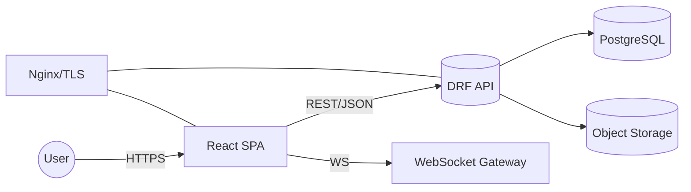
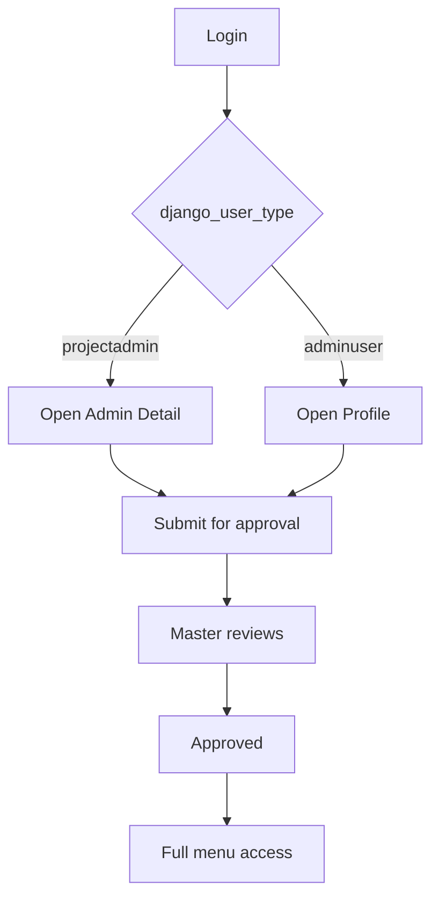

# EHS Management System — Technical & Functional Specification

Author: Augment Agent
Version: 1.0

## 1. Overview
A modular EHS platform with role/approval-aware UX, real-time notifications, and comprehensive domain coverage (Incidents, Safety Observations, Training, PTW, Meetings/MoM, Manpower, Projects). This document is a definitive reference for engineering and enterprise stakeholders.

## 2. System Architecture
- SPA Frontend (React 18 + TypeScript, Vite)
- REST API (Django REST Framework), JWT auth (access/refresh)
- WebSockets for notifications
- PostgreSQL RDBMS; object storage for uploads
- Nginx reverse proxy; TLS; CI/CD

### 2.1 Mermaid — High-level System Diagram


[Rendered diagram]


## 3. Frontend Architecture
- Libraries: React, React Router, Ant Design, Zustand, Axios, styled-components
- State: Auth store (token, roles, approval flags)
- Navigation: RoleBasedRoute + centralized menu config
- Approval banner + CTA routes (projectadmin → admindetail; adminuser → profile)

### 3.1 Key Code References
```tsx
// Menu gating
export const getMenuItemsForUser = (usertype?, django_user_type?, isApproved=true, hasSubmitted=true) => {
  if (usertype === 'master') return fullMasterMenu;
  if (!isApproved && (django_user_type === 'projectadmin' || django_user_type === 'adminuser')) {
    return getRestrictedMenuItems(django_user_type, hasSubmitted);
  }
  return fullMenuByRole(usertype, django_user_type);
};
```

```ts
// Approval status hook
if (usertype === 'master') { setAuthApprovalStatus(true, true); }
if (!['projectadmin','adminuser'].includes(django_user_type)) { /* skip */ }
const status = (await api.get('/authentication/approval/status/')).data;
```

## 4. Backend Architecture (Assumed Current)
- Django + DRF
- SimpleJWT (rotate+blacklist recommended)
- Channels/WebSocket notifications
- Endpoints: approval/status, admin/me, admin/detail/update, admin/detail/approve, userdetail/pending, admin/pending, companydetail, master-admin

## 5. Data Model (Logical)
- User(usertype, django_user_type, tokens)
- AdminDetail(company_name, phone, PAN/GST, logo, photo, approved)
- UserDetail(employee profile, attachments, approved)
- CompanyDetail(PAN/GST/logo)
- Incident, SafetyObservation, Training, PTW, MoM, Manpower, Project

## 6. Workflows
- Auth: JWT access/refresh, axios interceptors, forced logout on blacklist
- Approval: role-aware CTAs, restricted menus, master approval path
- EHS modules: incident/observation/training/PTW/MoM/manpower lifecycles

### 6.1 Mermaid — Approval Flow


[Rendered diagram]


## 7. Security
- JWT auth; refresh with rotation; blacklist invalid tokens
- CSRF header for non-GET (defense-in-depth)
- Route protection by usertype; approval gating by django_user_type
- Upload validation; least-privilege storage/DB
- Suggested: MFA, rate limiting, audit logs, AV scanning

## 8. Performance & Scalability
- Vite code-splitting; lazy routes for heavy modules
- WebSockets for push notifications
- DB indexing; pagination; background jobs for reports
- Horizontal scaling: API, WS, SPA via CDN

## 9. Compliance
- ISO 45001/14001 alignment, OSHA 1904 recordkeeping
- Access controls, evidence trails, immutable approvals/signatures

## 10. Deployment
- Containers (API + SPA) behind Nginx; TLS
- Env: API base URL, secrets, DB, storage, WS endpoints
- CI/CD with migrations, rollbacks, backups

## 11. Operations
- Logging/metrics/APM; alerting on error rates
- Backup/restore drills; DB maintenance
- Security reviews; dependency updates

## 12. Roadmap
- MFA + SSO
- Advanced analytics (risk heatmaps, predictive)
- Offline/mobile-first capture
- IoT sensors; GIS/geofencing for PTW
- DMS with versioning; automated regulatory reports

## 13. Appendix — Example Snippets
```tsx
// Role route guard
const RoleBasedRoute: React.FC<{ allowedRoles: string[]; children: React.ReactElement; }> = ({ allowedRoles, children }) => {
  const { usertype, token, isAuthenticated } = useAuthStore();
  if (!token || !isAuthenticated()) return <Navigate to="/login" replace />;
  const ok = !!usertype && (allowedRoles.includes(usertype) || (usertype.startsWith('contractor') && allowedRoles.some(r=>r.startsWith('contractor'))));
  return ok ? children : <Navigate to="/dashboard" replace />;
};
```

